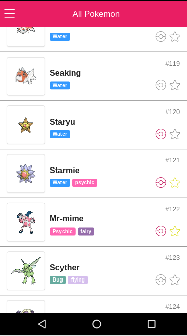

# Pokedex Angular App


## Information
Pokedex application in javascript
<table>

<tr>
<td>Name</td>
<td>Version</td>
</tr>

<tr>
<td>Node</td>
<td>>= 4.x</td>
</tr>

<tr>
<td>Bower</td>
<td>>=1.7.x</td>
</tr>

<tr>
<td>Gulp</td>
<td>>=3.x</td>
</tr>

</table>

Server pokedex Api

<table>

<tr>
<td>Name</td>
<td>Version</td>
</tr>

<tr>
<td>Docker</td>
<td>>= 1.11.x</td>
</tr>

<tr>
<td>Docker compose</td>
<td>>=1.5.x</td>
</tr>


</table>


## Installation

#### Pokedex AngularJs application
```
npm install --only=dev
bower install

```
#### Server API Installation
```
cd server
make build
make up
```

## Start development

```
gulp serve

```
[http://localhost:9000](http://localhost:9000/)

## Production

```
gulp serve:prod

```

## Testing

```
gulp test

```
